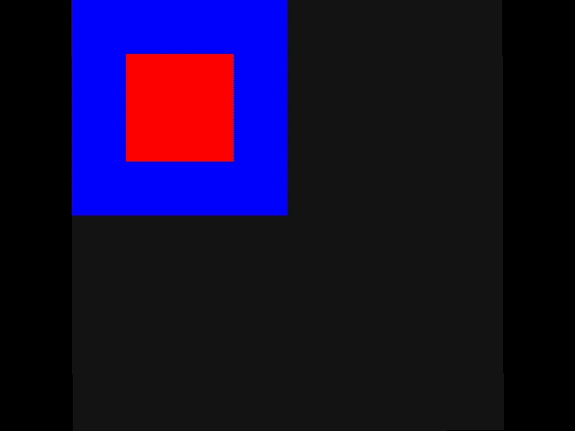
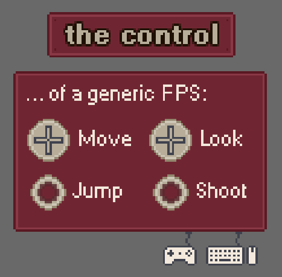

# Eterra Demo

A set of examples on how the Eterra framework can be used.

~~Download current version as ZIP (0.1)~~

[Download OpenAL redistributables for sound support on Windows (external link)](https://www.openal.org/downloads/oalinst.zip)

## About

This application is a collection of currently seven examples that should demonstrate how the *Eterra Framework* can be used to develop interactive multimedia applications. The code contains detailed documentation and comments and therefore also serves as a tutorial on how to use the different functions provided by the framework to develop applications with increasing complexity - starting from simple, static, rectangles to a short, but mildly entertaining 3D game.

For more information on what the *Eterra Framework* is, see the documentation of the main project [here](https://github.com/bauermaximilian/Eterra).

## Screenshots

### Example "Keyframe animation"

### Example "Control mappings"

### Example of a short walking simulator

## Build instructions

This project uses the _Eterra Framework_ and parts of the _Eterra Framework Platforms_ project solutions - these solutions need to be cloned/copied into the same root directory like this _Eterra Demo_ project solution for the build to be successful. If the build fails due to missing NuGet packages in _Eterra Framework for Windows_ and restoring the NuGet packages in the _Eterra Demo_ project solution doesn't work, try to open the _Eterra Framework Platforms_ solution, restore the NuGet packages and build that solution there, then return to the _Eterra Demo_ project and try again. If you have a different folder structure, the project (or assembly) references and the custom build action in _Eterra Demo_ need to be changed accordingly.
